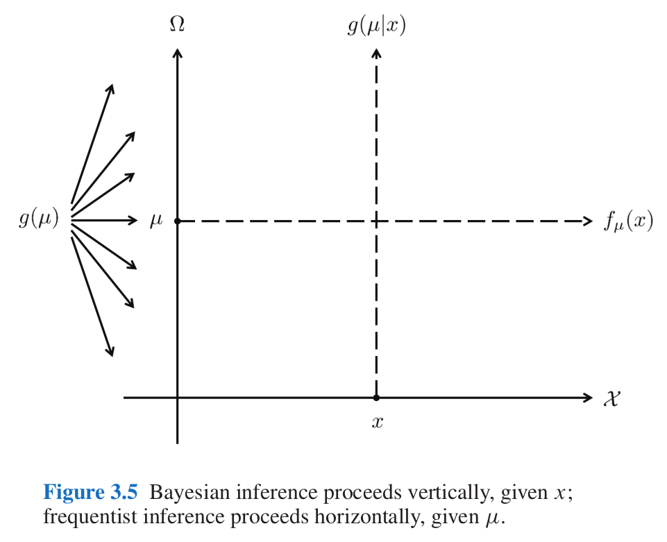

```{r setup04, include=FALSE}
knitr::opts_chunk$set(message = FALSE, warning = FALSE, comment = "")
options(scipen=999)
library(tidyverse)
theme_set(theme_bw())
library(latex2exp)
```


# Байесовский статистический вывод

## Нотация

В байесовском подоходе статистический вывод описывается формулой Байеса

$$P(θ|Data) = \frac{P(Data|θ)\times P(θ)}{P(Data)}$$

* $P(θ|Data)$ --- апостериорная вероятность (posterior)
* $P(Data|θ)$ --- функция правдоподобия (likelihood)
* $P(θ)$ ---  априорная вероятность (prior)
* $P(Data)$ --- нормализующий делитель

В литературе можно еще встретить такую запись:

$$P(θ|Data) \propto P(Data|θ)\times P(θ)$$

На прошлых занятиях мы говорили, что [функция правдоподобия не обязана интегрироваться до 1](https://stats.stackexchange.com/a/31241/225843), тогда почему, назвав часть формулы Байеса $P(Data|θ)$ функцией правдоподобия, мы оставляем нотацию будто это функция вероятностей? Потому что это условная вероятность, [она не обязана интегрироваться до 1](https://stats.stackexchange.com/q/448852/225843).

## Категориальный пример

Для примера я взял датасет, который содержит спамерские и обычные смс-сообщения, выложенный UCI Machine Learning [на kaggle](https://www.kaggle.com/uciml/sms-spam-collection-dataset) и при помощи пакета `udpipe` токенизировал и определил часть речи:

```{r, fig.width=9, fig.height=7}
sms_pos <- read_csv("https://raw.githubusercontent.com/agricolamz/2021_da4l/master/data/spam_sms_pos.csv")
glimpse(sms_pos)

sms_pos %>% 
  group_by(type) %>% 
  mutate(ratio = n/sum(n),
         upos = fct_reorder(upos, n, mean, .desc = TRUE)) %>%
  ggplot(aes(type, ratio))+
  geom_col()+
  geom_label(aes(label = round(ratio, 3)), position = position_stack(vjust = 0.5))+
  facet_wrap(~upos, scales = "free_y")
```

Давайте полученные доли считать нашей моделью: сумма всех чисел внутри каждого типа (`ham`/`spam`) дает в сумме 1. Мы получили новое сообщение 

> Call FREEPHONE 0800 542 0825 now! 

Модель `udpipe` разобрала его следующим образом: 

> VERB NUM NUM NUM NUM ADV PUNCT 

Понятно, что это -- спам, но мы пытаемся применить байесовский статистический вывод, чтобы определить тип сообшения. Предположим, что машина считает обе гипотизы равновероятными, т. е. ее априорное распределение гипотез равно 0.5 каждая. На минуту представим, что машина анализирует текст пословно. Первое слово типа `VERB`. Функция правдоподобия равны 0.135 и 0.096 для сообщений типа `ham` и `spam` соответственно. Применим байесовский апдейт:

```{r}
tibble(model = c("ham", "spam"),
       prior = 0.5,
       likelihood = c(0.135, 0.096),
       product = prior*likelihood,
       posterior = product/sum(product))
```

Вот мы и сделали байесовский апдейт. Теперь апостериорное распределение, которые мы получили на предыдущем шаге, мы можем использовать в новом апдейте. Следующее слово в сообщении типа `NUM`.

```{r}
tibble(model = c("ham", "spam"),
       prior_2 = c(0.584, 0.416),
       likelihood_2 = c(0.016, 0.117),
       product_2 = prior_2*likelihood_2,
       posterior_2 = product_2/sum(product_2))
```

Уже на второй итерации, наша модель почти уверена, что это сообщение `spam`. На третей итерации уверенность только растет:

```{r}
tibble(model = c("ham", "spam"),
       prior_3 = c(0.161, 0.839),
       likelihood_3 = c(0.016, 0.117),
       product_3 = prior_3*likelihood_3,
       posterior_3 = product_3/sum(product_3))
```

```{block, type = "rmdtask"}
Посчитайте вероятность гипотезы, что перед нами спамерское сообщение, если предположить, что каждое пятое сообщение -- спам. Ответ округите до трех знаков после запятой.
```

```{r, echo = FALSE, results='asis'}
library(checkdown)
tibble(model = c("ham", "spam"),
       prior = c(0.8, 0.2),
       likelihood = c(0.135, 0.096),
       likelihood_2 = c(0.016, 0.117),
       product = prior*likelihood*likelihood_2*likelihood_2,
       posterior = product/sum(product)) %>% 
  slice(2) %>% 
  pull(posterior) %>% 
  round(3) %>% 
  check_question()
```

Из формулы Байеса следует, что не обязательно каждый раз делить на нормализующий делитель, это можно сделать единожды.

```{r}
tibble(model = c("ham", "spam"),
       prior = 0.5,
       likelihood = c(0.135, 0.096),
       likelihood_2 = c(0.016, 0.117),
       product = prior*likelihood*likelihood_2*likelihood_2,
       posterior = product/sum(product))
```

Из приведенных рассуждений также следует, что все равно в каком порядке мы производим байесовский апдейт: мы могли сначала умножить на значение правдоподобия для категории `NUM` и лишь в конце на значение правдоподобия `VERB`.

Также стоит отметить, что если данных много, то через какое-то время становится все равно, какое у нас было априорное распределение. Даже в нашем примере, в котором мы проанализировали первые три слова сообщения, модель, что сообщение спамерское, выиграет даже, если, согласно априорное распределению, спамерским является каждое 20 сообщение:

```{r}
tibble(model = c("ham", "spam"),
       prior = c(0.95, 0.05),
       likelihood = c(0.135, 0.096),
       likelihood_2 = c(0.016, 0.117),
       product = prior*likelihood*likelihood_2*likelihood_2,
       posterior = product/sum(product))
```

Самым главным отличием байесовского статистического вывода от фриквентистского, является то, что мы в результате получаем вероятность каждой из моделей. Это очень значительно отличается от фриквентистской практики нулевых гипотез и p-value, в соответствии с которыми мы можем лишь отвергнуть или не отвергнуть нулевую гипотезу.


```{block, type = "rmdtask"}
Вашего друга похитили а на почту отправили [датасет](https://raw.githubusercontent.com/agricolamz/2021_da4l/master/data/weather.csv), в котором записаны данные о погоде из пяти городов. Ваш телефон зазвонил, и друг сказал, что не знает куда его похитили, но за окном легкий дождь (`Rain`). А в какой-то из следующих дней --- сильный дождь (`Rain, Thunderstorm`). Исходя из явно неверного предположения, что погода каждый день независят друг от друга, сделайте байесовский апдейт и предположите, в какой город вероятнее всего похитили друга (форма ожидает латиницу).
```

```{r, include=FALSE}
df <- read.csv("https://raw.githubusercontent.com/agricolamz/2021_da4l/master/data/weather.csv")
df %>%
  count(city, events) %>% 
  group_by(city) %>% 
  mutate(prop = n/sum(n)) %>% 
  ggplot(aes(city, prop, fill = events, label = round(prop, 3)))+
  geom_col()+
  geom_text(position = position_stack(vjust = 0.5), color = "white")

tibble(model = c("Auckland", "Beijing", "Chicago", "Mumbai", "San Diego"),
           prior_1 = 0.2,
           likelihood_1 = c(0.484, 0, 0.161, 0, 0.29),
           product_1 = prior_1*likelihood_1,
           posterior_1 = product_1/sum(product_1),
           likelihood_2 = c(0.032, 0, 0, 0, 0.065),
           product_2 = posterior_1*likelihood_2,
           posterior_2 = product_2/sum(product_2))
```

```{r, results='asis', echo=FALSE}
check_question(answer = "San Diego", options = c("Auckland", "Beijing", "Chicago", "Mumbai", "San Diego"))
```

```{block, type = "rmdtask"}
Укажите получившуюся вероятность. Выполняя задание, округлите все вероятности и значения правдоподобия до 3 знаков после запятой.
```

```{r, results='asis', echo=FALSE}
check_question(answer = 0.549)
```

## Разница между фриквентиским и байесовским подходами



Картинка из одной из моих любимых книг по статистике [@efron16: 34].